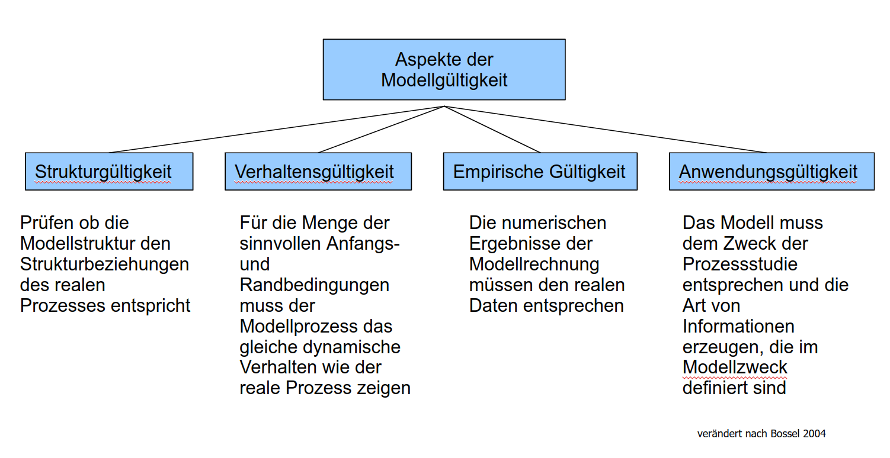
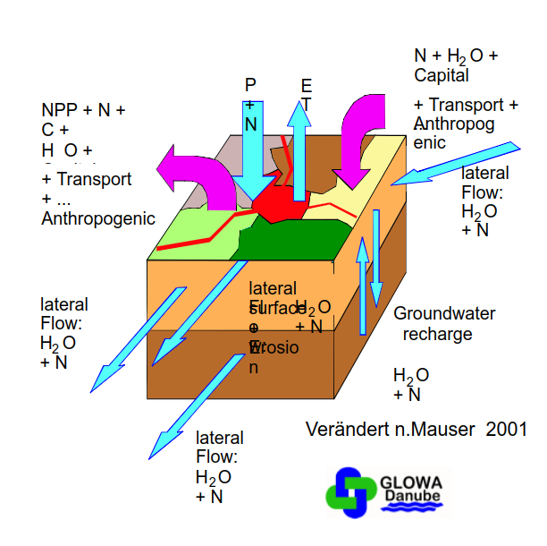
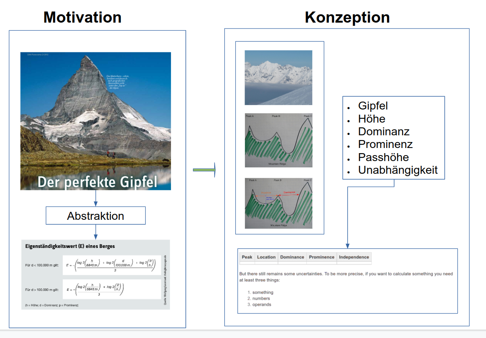
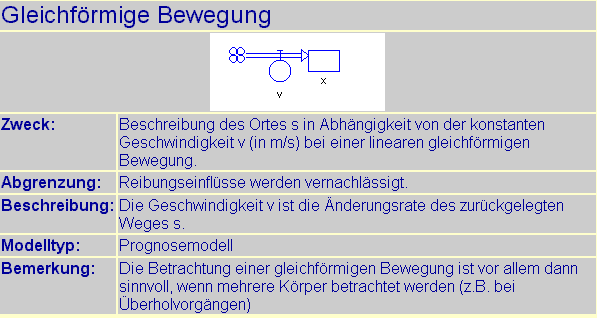
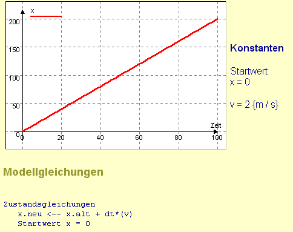

```{r setup, include=FALSE}
options(htmltools.dir.version = FALSE)
```


# Warum modellieren wir?


*„Der menschliche Geist ist unfähig anders als in Modellen zu denken.“* <sup>1</sup> 


* Modelle  sind  Hilfsmittel im Umgang mit und zur Interpretation der einer  überkomplexen  Realität zwingend

* Die Wahrnehmung und Interpretation der „realen Welt“, die Entwicklung geeigneter Strategien für den praxistauglichen Umgang (=Abstraktion) mit ihr findet durch Modellbildung statt.

.footnote[
[1] Christian Wissel: Theoretische Ökologie. Berlin: Springer 1989
]
---

# Modell was ist das …?

Bitte Diskutieren Sie in den nächsten 10 Minuten in den Breakout-Räume die folgenden drei Fragen:

* Welche Modelle kennen Sie? 
* Warum sollte Modellierung interessant oder nützlich sein?
* Was erwarte ich von Modellen?

.footnote[
Die Ergebnisse sammeln  wir auf [trello](https://trello.com/b/dd1CPBTC/systemdynamik)
]


---

# Warum gibt es wissenschaftliche Modellierung?

* Grundlagenforschung und angewandte Forschung benötigt Modelle zum 
* Erkenntnisgewinn
* Welt-Verstehen
* vertieftes  Prozessverständnis
* zur Hypothesenprüfung
* Prognosen ...

Experimente am realen System sind häufig:
* unmöglich
* unbezahlbar
* wenig sinnvoll weil irreversibel ...


---

# Systeme
Anordnung von Komponenten und Beziehungen
---

# Modelle
Abstraktionen von (real existierenden) Systemen

Modelle sind *nicht* universell sondern für einen spezifischen Zweck

---

# Simulationen

Nachahmung des Verhaltens des realen Systems


Literatur:<sup>1,2,3</sup> 

.footnote[
[1] H. Bossel: Systeme, Dynamik, Simulation – Modellbildung, Analyse und Simulation komplexer Systeme. Books on Demand , Norderstedt/Germany , 2004
[2] Monsef, Y.:  Modelling and Simulation of Complex Systems . Concepts , Methods and Tools , Society for Computer Simulation International . 1997
[3] Günther Ossimitz: Online -Skriptum zur Vorlesung Einführung in die Systemwissenchaften Uni Graz [Ossimitzskript](http://wwwu.uni-klu.ac.at/~gossimit/lv/usw00/skr/start.htm)_  Zugriff: 13 .4 .2009
]

---

# Mache die Dinge so einfach wie möglich, aber nicht einfacher<sup>1</sup>  

.pull-left[]

.pull-right[ Die Komplexität der realen Welt erzwingt Vereinfacht also **Abstraktion**
    
Durch eine **definierte Abstraktion** wird ein vereinfachtes **Modell** eines realen Systemausschnitts erzeugt

Das dynamische System wird durch eine strukturierte Menge von Merkmalen, die in einer funktionalen Beziehung stehen, dargestellt
]


**Dieser Vorgang  wird als Modellbildung bezeichnet**

.footnote[[1] in verschiedenen Varianten [zugeschrieben](https://quoteinvestigator.com/2011/05/13/einstein-simple/) u.a. Albert Einstein ]
---

# Modelle sind immer beschränkt gültige Abbildungen eines subjektiv wahrgenommenen Systems

 *"Die Australier führten das Kaninchen auf dem Kontinent ein und stellten fest, dass diese Kaninchen bald überall waren und die gesamte Nahrung fraßen, die für die einheimischen Arten zum Überleben notwendig war. Da die Kaninchen keinen natürlichen Feind hatten.*

 *Daraufhin führten die Australier den Fuchs auf dem Kontinent ein (Füchse ernähren sich von Kaninchen - das Vorbild).*

 *Um zu sehen, dass die Füchse bald überall zu finden waren. Aber sie ließen die Kaninchen in Ruhe. Denn sie fanden die einheimischen Beuteltiere (Beutelsäuger) viel leichter zu jagen"*

.footnote[
Cellier, F.E. (1991),  Continuous System Modeling, Springer-Verlag, New York
]
---

# Modellvalidität

* Subjektivität der Abstraktionsleistung

* Komplexität und Nicht-Linearität

* Auch logisch und fachlich valide Modelle  sind nicht *wahr*

**=> Modellgültigkeiten werden über Sensitivitätsanalysen  bestimmt**


* Ob ein Modell Wirklichkeitsausschnitte korrekt abbildet, lässt sich nicht beweisen

* Jedoch  lässt sich die Gültigkeit  für  einen  definierten Modellzweck  nachweisen

---

# Modellgültigkeiten



.footnote[
H. Bossel: Systeme, Dynamik, Simulation – Modellbildung, Analyse und Simulation komplexer Systeme. Books on Demand, Norderstedt/Germany, 2004
]
---


#  Deskriptive Modelle


.footnote[
[Environmental Informatics Marburg [CC-BY-NC-SA] via flickr.com](https://www.flickr.com/photos/environmentalinformatics-marburg) , nach [Bossel (2004)](https://www.zotero.org/envin_umr/items/VA9SBS9Q)
]
---

#  Funktionale Modelle


.footnote[
[Environmental Informatics Marburg [CC-BY-NC-SA] via flickr.com](https://www.flickr.com/photos/environmentalinformatics-marburg) , nach [Bossel (2004)](https://www.zotero.org/envin_umr/items/VA9SBS9Q) 
]
---

# Solides Fach- und Methodenwissen

.pull-left-60[
<a href="https://gis-ma.org/wp-content/uploads/Pika_ecolmod.jpg" title="Complex Model"></a><sup>1</sup> 
]

.pull-right-40[
<sup>2</sup> 
]

.footnote[
[1] [Environmental Informatics Marburg [CC-BY-NC-SA] via gis-ma.org](https://gis-ma.org/wp-content/uploads/Pika_ecolmod.jpg) , nach [Retzer & Reudenbach (2005)](https://doi.org/10.1016/j.ecolmodel.2005.03.003) 
[2] Mauser, W. et.al.: Zwischenbericht GLOWA – Danube Integrative Techniken, Szenarien und Strategien zur Zukunft des Wassers im Einzugsgebiet der Oberen Donau. 2001
]

---
 
 
# Wie ist der Ablauf ?

1. Das reale System wird beobachtet und analysiert. Definition der Problemstellung und des   _Modellzwecks_ 

2. Im Rahmen der Systemabgrenzung wird das Konzept des Systems entwickelt als   _Wortmodell_   beschrieben.

3. Auf Grundlage des Wortmodell werden die Wirkungsbeziehungen identifiziert und in einem   _Wirkungsgraphen_   abgebildet. Analyse der Dimensionen und Quantifizierung der Wirkungsbeziehungen.

4. Je nach verwendeter Software Entwurf und Implementierung des Simulationsdiagramms (Flussdiagramm).

5. Modelltest mit den gewählten Parametern.

---
class: center 
#  Problem erkennen und konzeptualisieren



---

#  Abstraktion 


---

# Realisierung


---

# Ein dynamisches „Primitivmodell“






---

# Zusammenfassung

Modellierung und Simulation sind Methoden, die der Analyse definierter Systeme dienen

* Wichtigste Ziele
  * Theoriebildung (Verständnis)
  * Hypothesenprüfung
  * Erkenntnis
  * Prognose  
  * Unterhaltung
  
Anforderungen an Modellbildungs- und Simulationsmethoden

  * adäquate Modellbeschreibung
  * korrekte und effiziente Ausführung
  * komfortable Durchführung von Simulationsexperimenten

---

# Anhang

---

# Zurück zur Realität

Realität - Wirklichkeit - Umweltwahrnehmung stellen in erster Linie ein kognitives Problem des Wahrnehmenden  dar

Es gibt zahlreiche erkenntnistheoretische Ansätze die  grundsätzlich in  zwei  verschiedene  Paradigmen  zur Abstraktion eingeteilt werden können

.footnote[
* Simon, F. B. (2006): Einführung in Systemtheorie und Konstruktivismus Heidelberg (Carl-Auer Verlag) [3.Aufl. 2008]
* Hans Günther Ruß: Wissenschaftstheorie, Erkenntnistheorie und die Suche nach Wahrheit. Eine Einführung, Kohlhammer Urban, Stuttgart 2004.
* Helmut Seiffert: Einführung in die Wissenschaftstheorie 1: Sprachanalyse, Deduktion, Induktion in Natur- und Sozialwissenschaften. Beck 2003
* Helmut Seiffert: Einführung in die Wissenschaftstheorie 3: Handlungstheorie, Modallogik, Ethik, Systemtheorie. Beck 2001
]
---

# Erkenntnistheoretische Paradigmen

### Reduktionistisch

Damit Wirklichkeit interpretierbar und abbildbar wird, muss sie (zumindest teilweise) abstrahierbar und abgrenzbarsein. Die Abgrenzbarkeit der Welt in Systeme ermöglicht erst deren Verständnis (Newton‘sches Weltbild)

### Holistisch

Eine Abgrenzbarkeit einzelner Weltausschnitte in Systeme der Welt ist nicht möglich, wünschenswert oder sinnvoll.  Interessierende Systeme müssen als ganzheitliche Phänomene betrachtet werden <sup>1</sup> 

.footnote[ [1] Zick, A., Das schamanische Weltbild als archaische Form des Konzepts "ökologische Ökonomie"  [Online](https://docplayer.org/24762861-Das-schamanische-weltbild-als-archaische-form-des-konzepts-oekologische-oekonomie.html)  Zugriff: 13.04.2021]
---
# Methoden der Abstraktion

„[...] Our only hope lies therefore in a true induction“ (<sup>1</sup> )

„Induction does simply not exist [...]“ <sup>2,3</sup>  

*Induktiv* aufgrund von Messdaten zur Identifikation und Validierung Beobachtungen, Messungen, Annahmen, statistische Verfahren (Data Mining), Lernverfahren der KI...

*Deduktiv* aufgrund von Kenntnissen und Einsicht über den Prozess (Gesetze , Prinzipien, Grundlagenwissen, Lehrmeinungen, Strukturwissen)

.footnote[
[1] Francis Bacon (1625): First Book of Aphorisms zit. n.[Bacon](http://www.fordham.edu/halsall/mod/bacon-aphor.html)  P. XIV. Zugriff 2.3.2007
[2] Karl Popper: Logik der Forschung (1934)
[3] Karl Popper: The Logic of Scientific Discovery (1959)
]

---

class: center, middle

Slides created via the R package [**xaringan**](https://github.com/yihui/xaringan).

The chakra comes from [remark.js](https://remarkjs.com), [**knitr**](https://yihui.org/knitr/), and [R Markdown](https://rmarkdown.rstudio.com).


---

